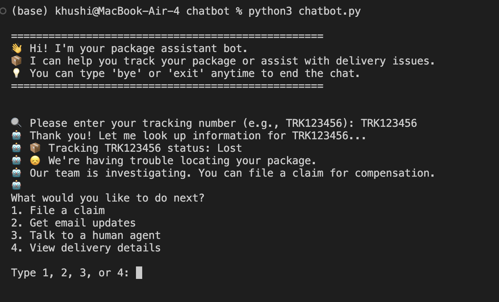
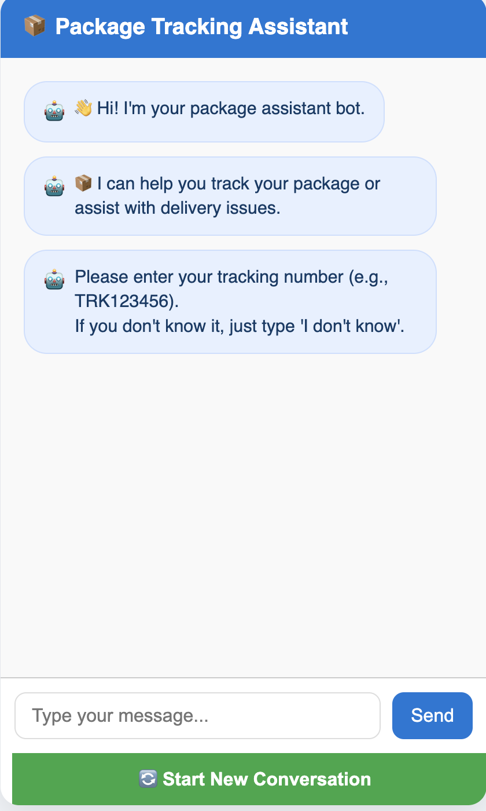
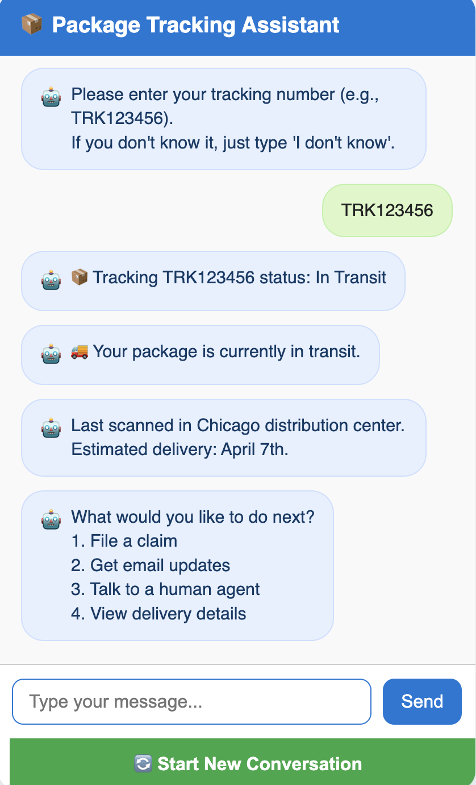
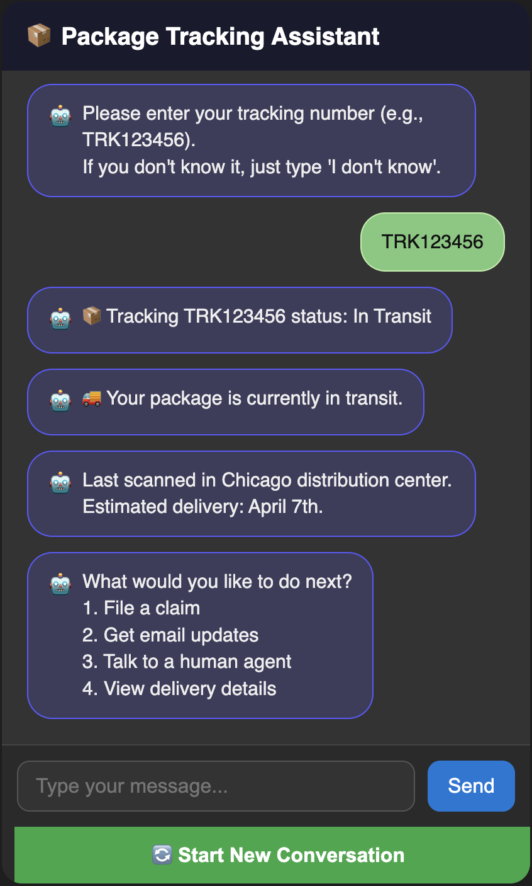

# Lost Package Tracking Chatbot

An interactive, user-friendly chatbot built using Python and HTML/CSS/JavaScript to help users track lost packages, receive updates, file claims, or connect with a human agent.

---

## Setup & Installation

### Command-Line Version (Python)
1. Clone or download the repository:
```bash
git clone https://github.com/chandrakhushi/chatbot-egain.git
```

2. Navigate to the project folder:
```bash
cd chatbot-egain
```

3. Run the chatbot:
```bash
python3 chatbot.py
```



---

### Web Version (No installation needed)
1. Open the `index.html` file in your browser:
   - Double-click the file, or
   - Right-click and choose "Open with" > your preferred browser

This project runs entirely in the browser — no dependencies or backend needed!



---

## Project Approach
This chatbot uses a step-by-step rule-based flow to assist users in locating their packages using tracking numbers or alternative identifiers (like email or order number).

### Flow Breakdown:
1. Ask for tracking number (or use email/order ID if unknown)
2. Simulate package status: Delivered / In Transit / Lost
3. Provide options to:
   - File a claim
   - Get email updates
   - Talk to a human agent
   - View detailed delivery timeline



---

## Features
- CLI version with typing animation and realistic status replies
- Web UI version with:
  - Dark/Light mode toggle 
  - Typing indicator
  - Restart button
  - Responsive and modern UI/UX
- Input validation for tracking numbers and email addresses
- Handles edge cases (missing/invalid info, unknown commands)



---

## 📁 File Structure
```
chatbot-egain/
├── index.html       # Web interface layout
├── style.css        # Chatbot styling
├── script.js        # Web chatbot logic
├── chatbot.py       # Python-based command-line chatbot
├── slides.pdf       # 3-4 slide presentation deck
├── README.md        # Project overview and instructions
├── cli-screenshot.png
├── web-start.png
├── web-status.png
└── dark-mode.png
```

---

## Future Enhancements
- Integrate real tracking APIs (UPS/FedEx)
- NLP-based input understanding
- Voice input support for accessibility
- Deploy live web version (e.g., GitHub Pages / Netlify)
- Persistent session with backend storage

---

## Author
Built by **Khushi Chandra**  
[Portfolio](https://ikhushi.com) • [LinkedIn](https://www.linkedin.com/in/khushi-chandra)
